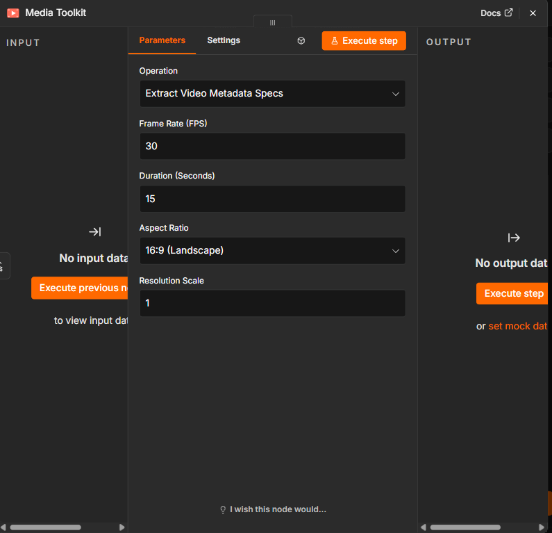

# n8n-nodes-media-toolkit

An [n8n](https://n8n.io) community node pack providing media-focused utility operations: video metadata spec calculations and social caption payload generation for TikTok, YouTube, and Instagram.

[](https://www.npmjs.com/package/n8n-nodes-media-toolkit)
[](https://www.npmjs.com/package/n8n-nodes-media-toolkit)
[](LICENSE)

<p align="center">
  
</p>

## Installation

### Via n8n UI (recommended)

1. Open your n8n instance
2. Go to **Settings > Community Nodes**
3. Click **Install a community node**
4. Enter `n8n-nodes-media-toolkit`
5. Accept the risks prompt and click **Install**

The **Media Toolkit** node will appear in your node palette after installation.

### Via npm (self-hosted)

```bash
npm install n8n-nodes-media-toolkit
```

Then restart your n8n instance.

## Operations

### Extract Video Metadata Specs

Calculates output video specifications from input parameters.

| Parameter | Type | Description |
|---|---|---|
| Frame Rate (FPS) | number | Frames per second (e.g. 24, 30, 60) |
| Duration (Seconds) | number | Video length in seconds |
| Aspect Ratio | options | `16:9`, `9:16`, or `1:1` |
| Resolution Scale | number | Multiplier on the HD base resolution (0.1–4) |

**Output:**

```json
{
  "frameRate": 30,
  "duration": 15,
  "aspectRatio": "9:16",
  "resolutionScale": 1,
  "totalFrames": 450,
  "outputWidth": 1080,
  "outputHeight": 1920
}
```

Base resolutions: `16:9` → 1920×1080, `9:16` → 1080×1920, `1:1` → 1080×1080. The scale multiplier is applied to both dimensions.

### Build Social Caption Payload

Trims caption text to platform limits and normalizes hashtags.

| Parameter | Type | Description |
|---|---|---|
| Caption Text | string | Raw caption text |
| Hashtags | string | Comma or space separated, `#` optional |
| Platform | options | `TikTok`, `YouTube`, or `Instagram` |

**Platform limits applied:**

| Platform | Caption chars | Max hashtags |
|---|---|---|
| TikTok | 2,200 | 5 |
| YouTube | 5,000 | 15 |
| Instagram | 2,200 | 30 |

**Output:**

```json
{
  "platform": "tiktok",
  "caption": "Check out this new video!",
  "hashtags": ["#media", "#automation", "#n8n"],
  "fullCaption": "Check out this new video!\n\n#media #automation #n8n",
  "characterCount": 52
}
```

## Example Workflow

1. **Schedule Trigger** → fires daily
2. **Media Toolkit** (Extract Video Metadata Specs) → computes render specs for a 9:16 short
3. **HTTP Request** → sends specs to your render pipeline
4. **Media Toolkit** (Build Social Caption Payload) → formats the caption for TikTok
5. **TikTok upload node / HTTP Request** → publishes with the generated `fullCaption`

## Credentials

This node pack does not require any credentials. All operations are pure data transformations performed locally within your n8n instance.

## Compatibility

- Requires n8n version 1.0.0 or later
- Node.js 18+

## Development

```bash
git clone https://github.com/Media-Studios/n8n-nodes-media-toolkit.git
cd n8n-nodes-media-toolkit
npm install
npm run build
```

To test locally, link the package into your n8n custom nodes directory:

```bash
npm link
cd ~/.n8n/custom
npm link n8n-nodes-media-toolkit
```

## Contributing

Contributions are welcome! Please read [CONTRIBUTING.md](CONTRIBUTING.md) for guidelines on submitting pull requests and reporting issues.

## License

[MIT](LICENSE)

## Resources

- [n8n community nodes documentation](https://docs.n8n.io/integrations/community-nodes/)
- [n8n node development docs](https://docs.n8n.io/integrations/creating-nodes/)
