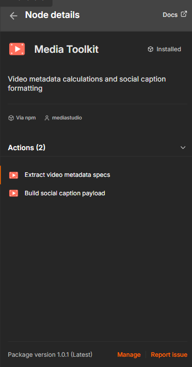

# n8n-nodes-media-toolkit

An [n8n](https://n8n.io) community node for media/content workflows: computes video render specs (resolution, frame count, bitrate, file-size estimate, and `ffmpeg` args) and builds platform-budget-aware social caption payloads for TikTok, YouTube Shorts, and Instagram/Reels.

[](https://www.npmjs.com/package/n8n-nodes-media-toolkit)
[](https://www.npmjs.com/package/n8n-nodes-media-toolkit)
[](LICENSE)

<p align="center">
  
</p>

## Installation

### Via n8n UI (recommended)

1. Open your n8n instance
2. Go to **Settings > Community Nodes**
3. Click **Install a community node**
4. Enter `n8n-nodes-media-toolkit`
5. Accept the risks prompt and click **Install**

The **Media Toolkit** node will appear in your node palette after installation.

### Via npm (self-hosted)

```bash
npm install n8n-nodes-media-toolkit
```

Then restart your n8n instance.

<details>
<summary><strong>Verify the install in n8n</strong></summary>

<br>

Once installed, n8n reports the package as <strong>Installed · Via npm</strong> with both actions available:

<p align="center">
  
</p>

</details>

## Operations

### Extract Video Metadata Specs

Turns render inputs into a full output spec: even-safe resolution, frame count,
a recommended H.264 bitrate, a file-size estimate, and ready-to-use `ffmpeg` args.

| Parameter | Type | Description |
|---|---|---|
| Frame Rate (FPS) | number | Frames per second (e.g. 24, 30, 60) |
| Duration (Seconds) | number | Video length in seconds |
| Aspect Ratio | options | `16:9`, `9:16`, `1:1`, or `4:5` |
| Resolution Scale | number | Multiplier on the 1080-class base resolution (0.1–4) |
| Target Bitrate (Mbps) | number | Bitrate for the file-size estimate; `0` auto-derives a recommended H.264 bitrate |

**Output:**

```json
{
  "frameRate": 30,
  "duration": 15,
  "aspectRatio": "9:16",
  "resolutionScale": 1,
  "totalFrames": 450,
  "outputWidth": 1080,
  "outputHeight": 1920,
  "resolutionLabel": "1080p",
  "aspectRatioDecimal": 0.5625,
  "megapixels": 2.07,
  "recommendedBitrateMbps": 6.22,
  "bitrateMbps": 6.22,
  "estimatedFileSizeMB": 11.66,
  "ffmpegScaleFilter": "scale=1080:1920",
  "ffmpegArgs": "-r 30 -s 1080x1920 -t 15 -b:v 6.22M",
  "renderParams": {
    "width": 1080, "height": 1920, "fps": 30,
    "durationSeconds": 15, "totalFrames": 450, "bitrateMbps": 6.22
  }
}
```

- **Base resolutions** — `16:9` 1920×1080 · `9:16` 1080×1920 · `1:1` 1080×1080 · `4:5` 1080×1350. The scale multiplier is applied to both dimensions.
- **Even dimensions** — width/height are rounded to the nearest even number (H.264/H.265 reject odd sizes).
- **Recommended bitrate** — `0.1 × width × height × fps ÷ 1e6` Mbps (H.264 rule of thumb), floored at 1 Mbps.
- **File-size estimate** — `bitrateMbps × duration ÷ 8` MB.

### Build Social Caption Payload

Sanitizes a caption and formats hashtags **within the platform's character budget** —
it reserves space for the hashtag block, de-duplicates tags, and trims the caption (not the tags) to fit.

| Parameter | Type | Description |
|---|---|---|
| Caption Text | string | Raw caption text |
| Hashtags | string | Comma or space separated, `#` optional |
| Platform | options | `TikTok`, `YouTube (Shorts)`, `Instagram`, or `Instagram Reels` |
| Lowercase Hashtags | boolean | Force all hashtags to lowercase |

**What it does:** strips control/zero-width characters and trailing spaces, collapses 3+ blank lines to one, de-duplicates hashtags case-insensitively (first-seen order kept), caps tags to the platform limit, then fits the caption so `caption + hashtags` never exceeds the platform ceiling.

**Platform limits applied:**

| Platform | Caption chars | Max hashtags |
|---|---|---|
| TikTok | 2,200 | 5 |
| YouTube (Shorts) | 5,000 | 15 |
| Instagram | 2,200 | 30 |
| Instagram Reels | 2,200 | 30 |

**Output:**

```json
{
  "platform": "tiktok",
  "caption": "Check out this new video!",
  "hashtags": ["#media", "#automation", "#n8n"],
  "hashtagBlock": "#media #automation #n8n",
  "fullCaption": "Check out this new video!\n\n#media #automation #n8n",
  "characterCount": 52,
  "platformCharacterLimit": 2200,
  "hashtagLimit": 5,
  "withinLimit": true,
  "truncated": false,
  "droppedHashtagCount": 0
}
```

## Example Workflow

1. **Schedule Trigger** → fires daily
2. **Media Toolkit** (Extract Video Metadata Specs) → computes render specs for a 9:16 short
3. **HTTP Request** → sends specs to your render pipeline
4. **Media Toolkit** (Build Social Caption Payload) → formats the caption for TikTok
5. **TikTok upload node / HTTP Request** → publishes with the generated `fullCaption`

## Credentials

This node pack does not require any credentials. All operations are pure data transformations performed locally within your n8n instance.

## Compatibility

- Requires n8n version 1.0.0 or later
- Node.js 18+

## Development

```bash
git clone https://github.com/Media-Studios/n8n-nodes-media-toolkit.git
cd n8n-nodes-media-toolkit
npm install
npm run build
```

To test locally, link the package into your n8n custom nodes directory:

```bash
npm link
cd ~/.n8n/custom
npm link n8n-nodes-media-toolkit
```

## Contributing

Contributions are welcome! Please read [CONTRIBUTING.md](CONTRIBUTING.md) for guidelines on submitting pull requests and reporting issues.

## License

[MIT](LICENSE)

## Resources

- [n8n community nodes documentation](https://docs.n8n.io/integrations/community-nodes/)
- [n8n node development docs](https://docs.n8n.io/integrations/creating-nodes/)
